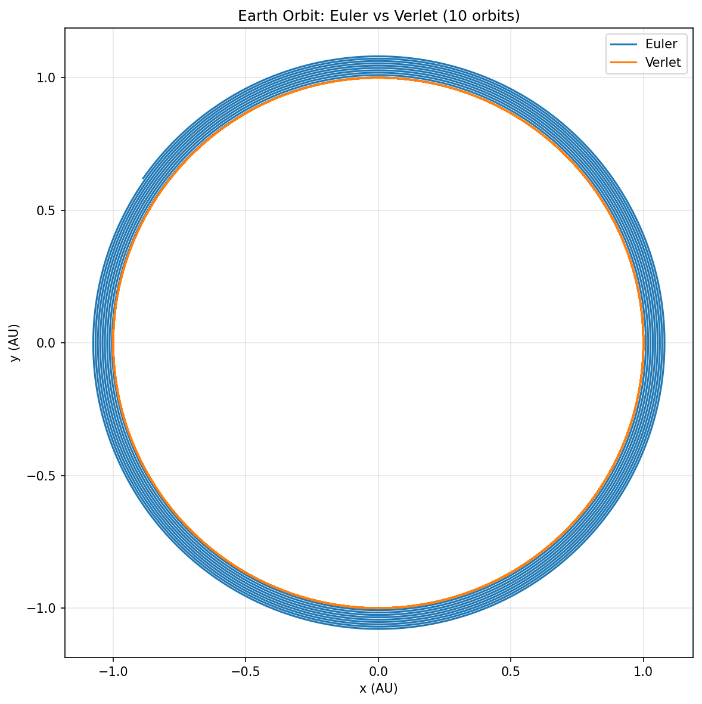
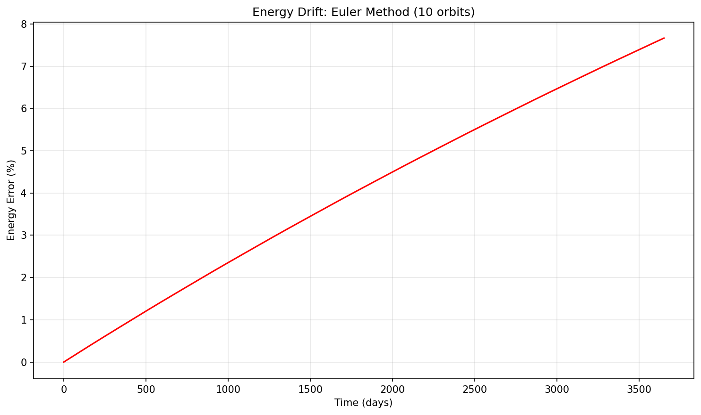
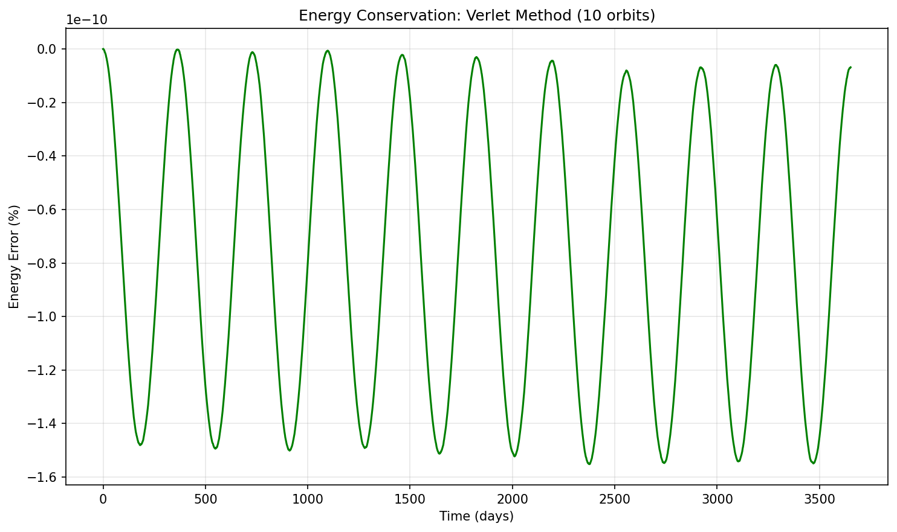

# Solar System N-Body Simulation

A gravitational N-body simulator demonstrating the importance of numerical integrators in computational physics.

## Euler vs Verlet: Why Integrators Matter

Using the same Newtonian gravity model and identical initial conditions,
we simulated the Sun–Earth system with two different time integrators.

### Orbit comparison

- Euler causes the orbit to slowly spiral outward.
- Verlet produces a closed, stable orbit.

### Energy behavior

- Euler introduces a systematic energy drift.
- Verlet conserves total energy up to small bounded oscillations.

**Key point**:  
The physics did not change.  
Only the numerical treatment of time did.

This demonstrates that simulations encode assumptions not just about
physical laws, but about how those laws are approximated computationally.

